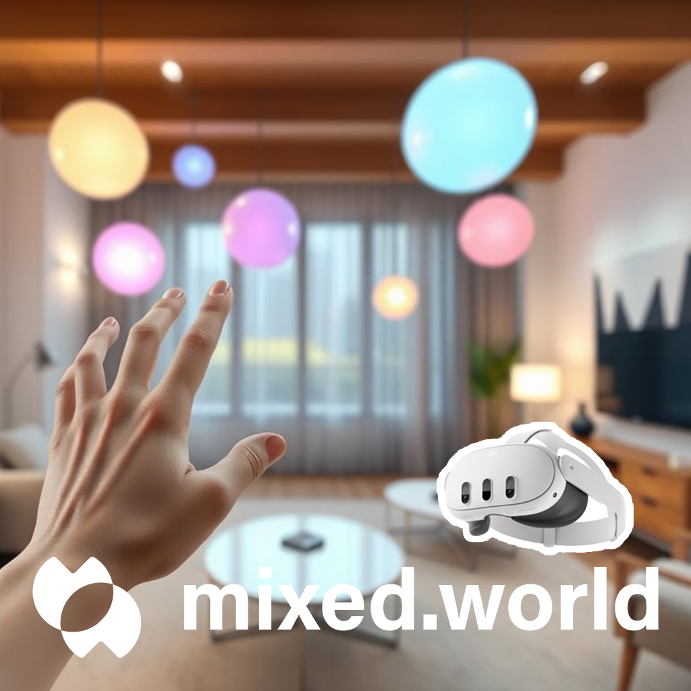

# HDRBloomPassthrough4Quest

A Unity URP (Universal Render Pipeline) sample project that enables HDR and post-processing effects (specifically Bloom) to work correctly with Meta Quest's Passthrough feature in Mixed Reality applications.

## Overview

This project provides modified URP shaders that properly handle alpha transmission in post-processing shaders, allowing developers to use HDR and Bloom effects in Passthrough-enabled Mixed Reality applications on Meta Quest devices, including:
- Meta Quest 2
- Meta Quest Pro
- Meta Quest 3
- Meta Quest 3s

## Demo

Watch the demo video to see HDR and Bloom effects working with Quest Passthrough!

## Features

- ✨ HDR rendering support with Passthrough
- 🌟 Bloom post-processing effect compatibility
- 🎯 Alpha channel preservation in post-processing pipeline
- 📱 Compatible with all recent Meta Quest devices

## Getting Started

1. Clone this repository
2. Open the project in Unity (recommended version: 2022.3.43f1 or later)
3. Ensure URP is properly set up in your project
4. Add the mixed.world/Quest/PassthroughPostProcessing/Runtime/Scenes/BloomHDRPP-Demo.unity scene to your build settings
5. Build and run the project on a Meta Quest device

## Requirements

- Unity 2022.3.x or later
- Universal Render Pipeline (URP) package
- Meta XR SDK

## How It Works

The project modifies the standard URP post-processing shaders to properly handle alpha channel transmission throughout the rendering pipeline, ensuring that Passthrough content blends correctly with HDR and Bloom effects.

## Usage

[Add specific instructions on how to implement in a project]

## Known Limitations

[List any known limitations or issues]

## Contributing

Contributions are welcome! Please feel free to submit a Pull Request.

## License

This project is licensed under the MIT License - see the [LICENSE](LICENSE) file in the project root for details.

## Acknowledgments

[Add any acknowledgments if applicable]